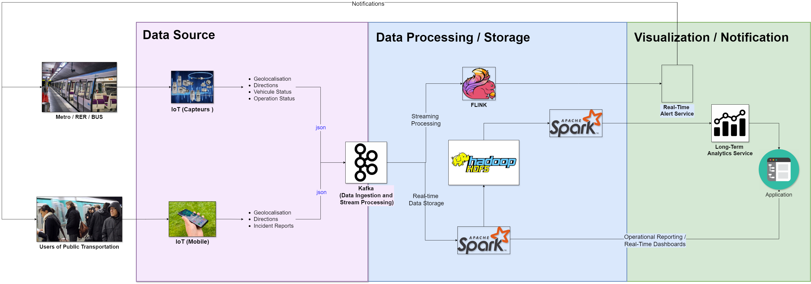

# Application de Détection de Personnes sur les Rails de Métro

Ce projet vise à développer une application capable de détecter la présence de personnes sur les rails de métro et de déclencher une alerte secours en cas de danger. Voici les détails de chaque composant de notre architecture :

## Capteurs de Détection sur les Rails
Installer des capteurs le long des rails de métro pour détecter la présence de personnes et collecter des données en temps réel sur l'occupation des voies.

## Système de Traitement des Données de Capteurs
Développer un système pour traiter les données provenant des capteurs de manière efficace et en temps réel. Ce système identifiera les situations d'urgence et déclenchera des alertes lorsque la présence de personnes sur les rails est détectée.

## Gestion des Alertes Secours
Mettre en place un mécanisme pour gérer les alertes secours déclenchées par le système de détection. Les alertes doivent être transmises aux autorités compétentes et aux équipes de secours pour intervention immédiate.

## Interface Utilisateur pour la Surveillance
Développer une interface utilisateur intuitive qui permettra aux opérateurs du métro de surveiller en temps réel l'état des voies et de recevoir les alertes en cas de présence de personnes sur les rails.
   
### Technologies et Méthodes
Capteurs IoT : Utilisation de capteurs IoT pour la détection de personnes sur les rails de métro, avec une transmission des données en temps réel.
Scala et Programmation Fonctionnelle : Tout le code sera écrit en Scala en suivant les principes de la programmation fonctionnelle, pour garantir la fiabilité et la maintenabilité du système.
Traitement en Temps Réel : Utilisation de technologies de traitement des données en temps réel telles que Apache Kafka pour assurer une réactivité maximale du système.
Gestion des Alertes : Développement d'un système robuste de gestion des alertes pour garantir que les interventions de secours sont effectuées rapidement et efficacement.

# File Descriptions

### simulation/alert/DataAlertGenerator.scala
*Purpose*: Generates alerts based on specific conditions in the data. It reads data, checks for alert conditions (e.g., threshold breaches), and generates alert messages.

### simulation/analysis/DataAnalysis.scala
*Purpose* : Performs data analysis on the dataset. This could involve data aggregation, statistical analysis, or deriving insights from the data to understand patterns and trends.

### simulation/data/PopulationGenerator.scala
*Purpose*: Generates synthetic population data for simulation purposes. This involves creating random or semi-random data entries representing individuals with various attributes.

### simulation/management/PopulationManagement.scala
*Purpose*: Manages the generated population data. This includes updating, storing, or processing the data to ensure it remains consistent and useful for simulations.

### simulation/model
*Purpose*: Contains case classes or data models used across the simulation project to represent different data entities such as people, movements, or traffic conditions.

### simulation/movement/PersonMovement.scala
*Purpose*: Simulates or processes the movement of individuals. This involves calculating positions, speeds, or paths individuals take over time in the simulation.

### simulation/serialization/JsonSerializer.scala
*Purpose*: Provides functionality to serialize and deserialize data to and from JSON format. This is essential for data interchange, especially when dealing with Kafka or REST APIs.

### simulation/traffic/TrafficConditions.scala
*Purpose*: Simulates or evaluates traffic conditions. This involves calculating traffic flow, congestion levels, or simulating traffic patterns in different scenarios.

### Main.scala
*Purpose*: The main entry point for the application. This file initializes the application, sets up necessary configurations, and starts the simulation or data processing tasks.

### IoTProducer.scala
*Purpose*: Simulates data production from IoT devices. This involves generating real-time data streams that mimic data from sensors or other IoT devices.

### KafkaDataProducer.scala
*Purpose*: Produces data and sends it to a Kafka topic. This involves setting up Kafka producer configurations and sending data messages to Kafka for consumption by other services or applications.

### MetroDataProcessing.scala
*Purpose*: Processes real-time metro data streamed from Kafka. This includes reading from Kafka topics, applying transformations, and possibly writing results back to Kafka or another storage.

### SparkAnalysis.scala
*Purpose*: Performs data analysis using Apache Spark. This involves reading data from Kafka, applying analytical transformations, and outputting the results, leveraging Spark's capabilities for handling large-scale data processing.

### SparkDataProcessing.scala
*Purpose*: Reads data from a Kafka topic (metro-data), processes it in real-time using Apache Spark, and writes the processed data to MongoDB.

Kafka Data Reading: Uses spark.readStream to read data from Kafka.
Data Processing: Filters the data to identify alert conditions.
Data Writing: Writes the alert data to MongoDB.

### SparkAnalysis.scala
Purpose*: Analyzes streaming data from Kafka to detect certain conditions (e.g., position less than 300 when scenario is 'off') and outputs the results to the console.

Kafka Data Reading: Reads streaming data from Kafka.
Data Processing: Parses JSON data, filters based on specific conditions, and outputs the results to the console.

### AlertHandler.scala
Purpose: Handles alerts by consuming data from the Kafka metro-data topic, detecting specific conditions, and sending alert messages to another Kafka topic (alerts-topic).

Kafka Consumer: Consumes data from the metro-data topic.
Alert Detection: Processes the data to detect alert conditions.
Kafka Producer: Sends alert messages to the alerts-topic.

